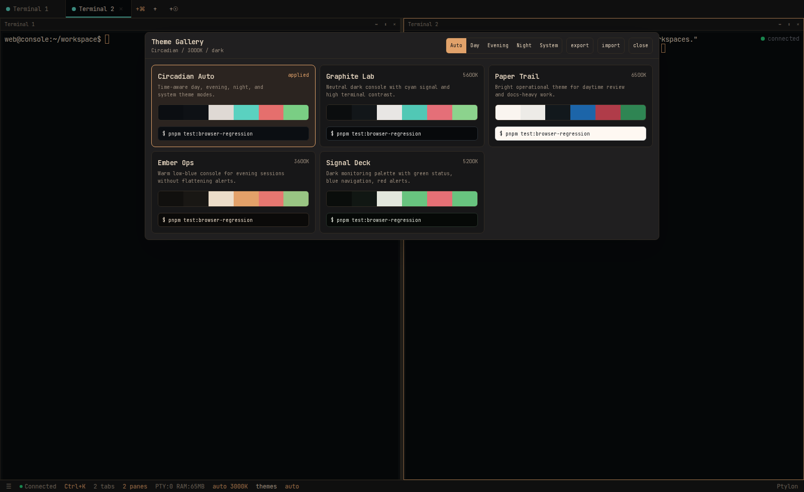
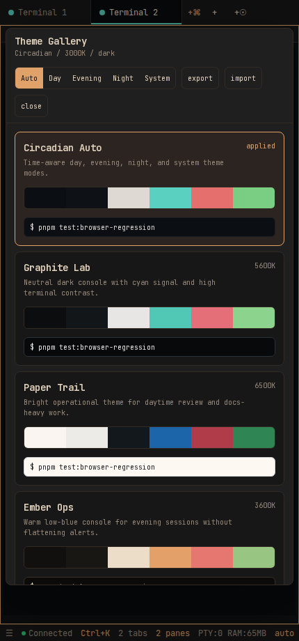

<p align="center">
  
</p>

# Ptylon

> A self-hosted, browser-native terminal workspace — Termius in a browser tab.

[](https://github.com/alexfrmn/ptylon/actions/workflows/ci.yml)
[](https://nodejs.org/)
[](LICENSE)


**Ptylon** brings persistent terminals, browser tools, files, editing, and
workspaces into one browser tab. It is designed for a server you control—not a
hosted shell service.

| [Quick start](#quick-start) | [Docker](#docker-compose) | [Architecture](#architecture) | [Production](#production-with-systemd) | [Contributing](CONTRIBUTING.md) |
| --- | --- | --- | --- | --- |

## Why Ptylon

- **Keep the shell alive.** A dedicated PTY daemon owns `node-pty` sessions, so a
  WebSocket gateway restart does not terminate running shells.
- **Work in context.** Split panes, named workspaces, file management, Monaco
  editing, and server-rendered browser tabs stay together.
- **Run it yourself.** The repository includes a guarded systemd installer,
  reverse-proxy guidance, a production smoke check, and an explicit security
  boundary around the server workspace.

## Screenshots

<p align="center">
  
  
</p>

Browser terminal workspace: xterm.js terminals, server-rendered browser tabs,
split panes, workspaces, file manager, Monaco editor, drag-and-drop uploads,
voice input, circadian display theme, and a theme gallery.

The production architecture keeps shell processes outside the browser WebSocket
gateway. A long-lived PTY daemon owns `node-pty` sessions; the authenticated
WebSocket gateway only proxies terminal I/O. This lets the gateway restart
without killing running shells.

## Architecture

```text
browser
  -> Next.js app :8790
       -> server-side Chrome sessions for browser panels
  -> authenticated WS gateway :8791
       -> localhost PTY daemon :8792
            -> raw node-pty bash sessions

SQLite data: ./data/web-console.db
Workspace state: localStorage + SQLite
Uploads: configurable UPLOAD_DIR
```

Services:

```text
web-console.service      Next.js standalone app, port 8790
web-console-ws.service   authenticated WebSocket gateway, port 8791
web-console-pty.service  localhost-only PTY daemon, port 8792
```

## Requirements

- Node.js 22+
- pnpm
- Linux with PTY support
- Build tools needed by `node-pty`

## Quick Start

### Docker Compose

The recommended self-hosted path is Docker Compose. All three runtime services
run as an unprivileged `ptylon` user; application state and the workspace live
in named volumes.

```bash
git clone https://github.com/alexfrmn/ptylon.git
cd ptylon
cp .env.example .env
$EDITOR .env # set strong AUTH_PASSWORD, JWT_SECRET, and WEB_CONSOLE_ADMIN_TOKEN
docker compose up -d --build
docker compose ps
```

By default, the app (`8790`) and WebSocket gateway (`8791`) bind only to
`127.0.0.1`. Put HTTPS and an access gate in a local reverse proxy. If the
reverse proxy is on another host, set `PTYLON_APP_BIND=0.0.0.0` and
`PTYLON_WS_BIND=0.0.0.0`, then firewall both ports so only that proxy can reach
them. The PTY daemon is never published; it is reachable only on the private
Compose network.

For upgrades, run `git pull && docker compose up -d --build`. Do not run
`docker compose down -v` unless you intentionally want to destroy workspace and
SQLite state.

### Manual local run

```bash
cp .env.example .env
$EDITOR .env
pnpm install
pnpm build
pnpm start:pty
pnpm start:ws
PORT=8790 pnpm start
```

Open `http://127.0.0.1:8790`.

Required `.env` values:

```dotenv
AUTH_PASSWORD=change-me
JWT_SECRET=replace-with-a-long-random-secret
PORT=8790
WS_PORT=8791
# Set 0.0.0.0 when a reverse proxy on another host forwards /ws to this gateway.
WS_HOST=127.0.0.1
NEXT_PUBLIC_WS_PORT=8791
PTY_DAEMON_HOST=127.0.0.1
PTY_DAEMON_PORT=8792
PTY_DAEMON_URL=ws://127.0.0.1:8792
PTY_IDLE_TIMEOUT_HOURS=168
WORKSPACE_ROOT=/workspace
ALLOWED_CWD_ROOT=/workspace
UPLOAD_DIR=/workspace/uploads
NEXT_PUBLIC_WORKSPACE_ROOT=/workspace
NEXT_PUBLIC_UPLOAD_DIR=/workspace/uploads
NEXT_PUBLIC_APP_LABEL=Ptylon
# Optional for server-side browser panels and admin browser automation:
# CHROME=/usr/bin/google-chrome
# WEB_CONSOLE_BROWSER_SESSION_TTL_MS=600000
```

When Nginx Proxy Manager or another reverse proxy reaches the gateway over the
network, set `WS_HOST=0.0.0.0`; binding only to loopback will make the UI show
`Disconnected` even though the HTTP application remains healthy.

`GROQ_API_KEY` is optional and only needed for voice transcription.

## Production With Systemd

The supplied units deliberately run as an unprivileged `webconsole` user. Do
not change them to `root`: the terminal and file APIs have the same privileges
as this account.

For a clean server, the turnkey path is:

```bash
git clone https://github.com/alexfrmn/ptylon.git
cd ptylon
sudo ./scripts/install-systemd.sh
```

It creates an unprivileged account, workspace, generated secrets, production
build, systemd services, and a needrestart guard. It prints the generated app
password once. Configure HTTPS and an external access gate in nginx/Caddy
before exposing it beyond the server. If nginx/NPM runs on another host, allow
only that proxy host to reach ports `8790` and `8791`; `/ws` must reach `8791`.

Create the service account and a dedicated workspace before installing units:

```bash
sudo useradd --system --create-home --home-dir /var/lib/webconsole --shell /usr/sbin/nologin webconsole
sudo install -d -o webconsole -g webconsole -m 0750 /workspace /workspace/uploads
sudo mkdir -p /opt
sudo cp -a "$PWD" /opt/web-console
sudo chown -R webconsole:webconsole /opt/web-console
sudo install -m 644 deploy/systemd/web-console.service /etc/systemd/system/web-console.service
sudo install -m 644 deploy/systemd/web-console-pty.service /etc/systemd/system/web-console-pty.service
sudo install -m 644 deploy/systemd/web-console-ws.service /etc/systemd/system/web-console-ws.service
sudo systemctl daemon-reload
sudo systemctl enable --now web-console-pty.service web-console-ws.service web-console.service
```

Set both `WORKSPACE_ROOT` and `FILE_ACCESS_ROOT` to the dedicated workspace.
`FILE_ACCESS_ROOT` is an allow-list boundary for the file manager, editor, and
uploads. `ALLOW_FULL_FILESYSTEM=true` is an unsafe compatibility escape hatch,
not a production setting.

On Ubuntu hosts with `unattended-upgrades`, also install the `needrestart`
override:

```bash
sudo install -d /etc/needrestart/conf.d
sudo install -m 644 deploy/needrestart/99-web-console-protect-interactive.conf /etc/needrestart/conf.d/99-web-console-protect-interactive.conf
sudo needrestart -b -r l
```

`web-console-pty.service` is interactive state, not a normal stateless daemon.
If `needrestart` restarts it after an automatic package upgrade, every live
shell, editor, Claude Code session, and child browser process inside the PTY
daemon cgroup is killed. The override keeps package upgrades from automatically
restarting the PTY owner. Restart it manually only when you accept losing live
sessions.

Deploy/rebuild:

```bash
pnpm build
sudo systemctl restart web-console.service
sudo systemctl restart web-console-ws.service
```

Restarting `web-console-ws.service` should not kill shell sessions. Restarting `web-console-pty.service` still kills live PTY processes, because it is the owner of those processes.

## Verification

```bash
pnpm exec tsc --noEmit
pnpm lint
pnpm build
pnpm test:pty-gateway
pnpm test:browser-regression
```

`pnpm test:pty-gateway` starts a temporary PTY daemon and gateway, creates a shell, restarts only the gateway, reattaches to the original session, and verifies scrollback/output still works.

`pnpm test:browser-regression` drives a headless Chrome against a running Ptylon instance. It verifies manual auth, terminal creation, terminal connection, terminal input echo, click-to-cursor arrow input, live session metadata, OSC notifications, recipes, mobile-reachable workspace actions, theme gallery apply/reset with server-side theme sync, server-side browser panel rendering, visible browser click/type input, and shared UI/admin browser sessions. By default it targets `http://127.0.0.1:8790` and `ws://127.0.0.1:8791`, and reads `AUTH_PASSWORD` from `.env`; override with `WC_BASE_URL`, `WC_WS_URL`, `WC_AUTH_PASSWORD`, `WC_ADMIN_TOKEN`, `CHROME`, or `WC_REGRESSION_OUT`.

`pnpm test:playwright-smoke` is a smaller browser proof: it verifies application login, a visible `Connected` terminal state, and a browser WebSocket attach. To validate a reverse proxy protected with HTTP Basic Auth, run it with `WC_BASE_URL=https://console.example.com WC_BASIC_USER=... WC_BASIC_PASS=... pnpm test:playwright-smoke`. Keep those credentials outside the repository.

The browser regression also verifies live terminal attention notifications. A process can raise an unread badge with OSC 777:

```bash
printf '\033]777;notify;Build failed;Check the active pane\007'
```

Recipes can be added in `${WORKSPACE_ROOT}/.web-console.json` and launched from the command palette (`Ctrl+K`). See `.web-console.example.json` for the schema. Recipe tabs support `type`, `name`, `color`, `cwd`, `command`, `filePath`, and browser-tab `url`.

`webc` is the localhost control CLI for scripts and agents:

```bash
pnpm webc ping
pnpm webc recipes
pnpm webc workspace create shell-pair
pnpm webc workspace delete <workspace-id>
pnpm webc browser panel http://127.0.0.1:8790
pnpm webc browser panel --local 8790
pnpm webc browser snapshot http://127.0.0.1:8790
pnpm webc notify "Build failed" "Check web-console"
```

Browser automation is available through the same localhost admin guard:

```bash
pnpm webc browser open http://127.0.0.1:8790
pnpm webc browser frame <url-or-sessionId> /tmp/frame.jpg
pnpm webc browser click <sessionId> 'button[title="Browser Panel"]'
pnpm webc browser point-click <sessionId> 400 240
pnpm webc browser fill <sessionId> 'input[aria-label="Browser URL"]' 'http://127.0.0.1:8790'
pnpm webc browser type <sessionId> 'hello'
pnpm webc browser scroll <sessionId> 600
pnpm webc browser back <sessionId>
pnpm webc browser forward <sessionId>
pnpm webc browser reload <sessionId>
pnpm webc browser eval <sessionId> 'document.title'
pnpm webc browser screenshot <sessionId> /tmp/web-console.png
pnpm webc browser close <sessionId>
```

Snapshots redact obvious secrets and emails by default. Screenshot bytes and arbitrary page eval are explicit CLI/API actions because they can expose whatever is visible in the browser.

## Theme Gallery

The status bar theme control still cycles `auto`, `day`, `evening`, `night`, and `system`. Open the Theme Gallery from the `themes` status button, Shift-click the theme readout, or run `Theme gallery` from `Ctrl+K`.

The gallery includes curated palettes, live preview on hover/focus, apply-on-click, and JSON import/export for fixed palettes. The selected palette is stored in browser `localStorage` as `circadian-theme-palette`; imported custom palettes are stored in `circadian-theme-custom-palettes`.

`Circadian Auto` leaves CSS variables under the existing time-aware phase system. Fixed palettes apply CSS variables directly to `:root`, then emit the same `circadian-theme-change` event used by xterm.js and Monaco. This keeps terminal and editor theme updates on the existing integration path.

## Mobile Workspace Controls

Workspace rows support both desktop right-click and touch-first actions. On mobile, open the sidebar from the status bar and use the `...` button on a workspace row to access rename, duplicate, and delete. This avoids relying on a context menu gesture that phones do not expose reliably.

Recipe workspaces can create several terminal panes at once. Each terminal/editor/browser pane is keyed by its tab ID so switching panes on narrow screens remounts the correct panel instance instead of reusing stale component state from another tab. Keep this behavior when changing mobile split rendering or recipe launch.

## Server-Side Browser Panel

Browser tabs are not iframe previews. The visible panel is a JPEG frame stream from a server-side Chrome session owned by `web-console.service`. Mouse, keyboard, paste, wheel, back, forward, and reload actions are sent to Chrome through CDP.

Each browser tab persists a `browserSessionId`, so the UI and `webc browser` can control the same Chrome session. This is what lets an agent open a browser panel, inspect it through `webc browser snapshot` or `webc browser frame`, and then continue in the visible workspace tab.

There are two browser APIs:

- `/api/browser` is for the logged-in UI. It uses normal app auth and does not expose the admin token to client JavaScript.
- `/api/admin/browser` is for localhost scripts and agents. It is loopback-only and token-guarded by `WEB_CONSOLE_ADMIN_TOKEN` or `JWT_SECRET`.

`localhost` inside a browser panel means localhost on the Ptylon server, not on the laptop or phone viewing the UI. Use `pnpm webc browser panel --local <port>` for server-local previews.

Visible panel frames use compressed JPEG by default. Idle active tabs poll slowly, loading tabs poll faster, typed text is batched, and wheel events are throttled. This keeps the panel usable for dogfooding, but it is still a screenshot-polling surface, not a video/WebRTC stream.

Server browser sessions have a TTL (`WEB_CONSOLE_BROWSER_SESSION_TTL_MS`, default 10 minutes). On `web-console.service` shutdown, the app closes all active browser sessions, signals each Chrome process group, and cleans session-specific crashpad helper processes. Restarting `web-console.service` intentionally ends browser sessions; it must not leave orphan Chrome processes behind.

Some sites detect headless Chrome or datacenter/server IPs. Anti-bot flows such as endless Cloudflare-style checks or IP reputation checks are expected limitations of this mode. Use direct APIs, `curl`, or a future headed/VNC/residential-proxy design for those targets.

## Operational Notes

- `web-console-pty.service` binds to `127.0.0.1` only. Do not expose it publicly.
- On Ubuntu, install the `needrestart` override before relying on long-lived sessions. Automatic service restarts can otherwise kill active PTYs during unattended upgrades.
- Browser WebSocket auth is enforced by the httpOnly JWT cookie; the bearer
  token is never placed in the WebSocket URL or proxy access logs.
- Auth cookies are secure in production, except for loopback localhost testing. Set `ALLOW_INSECURE_COOKIE=true` only for explicit local HTTP testing on non-loopback hosts.
- PTY creation confines requested cwd values under `ALLOWED_CWD_ROOT`/`WORKSPACE_ROOT`.
- Idle terminal cleanup is controlled by `PTY_IDLE_TIMEOUT_HOURS`. The default is 168 hours, and values below 48 hours are raised to 48 hours.
- Workspace layout persists both in browser `localStorage` and SQLite.
- Manual login after auth expiry must load SQLite state before the authenticated UI starts saving. Otherwise stale browser `localStorage` can overwrite the server workspace and make live PTY sessions look lost.
- The client only clears missing terminal session IDs after receiving a trusted live session list from the gateway.
- If the PTY daemon reports live sessions that are not referenced by the saved workspace, the client should recover them as terminal tabs instead of leaving them orphaned.
- Terminal attention notifications are driven only by live OSC output, not scrollback replay. Supported inputs are OSC 777 notify, OSC 99 title/body/done, and OSC 9 fallback.
- Session metadata is collected outside the shell from `/proc` and `git -C`; it does not inject prompt hooks or write to PTY stdin. The UI shows cwd, git branch/dirty state, and active command when available.
- The command palette reads built-in recipes plus `${WORKSPACE_ROOT}/.web-console.json`; recipe `command` values run as terminal init commands after PTY creation.
- Monitoring recipe should start all four pane commands (`top`, `journalctl`, network, disk); `pnpm test:browser-regression` verifies this.
- The admin control plane is localhost-only and token-guarded. Set `WEB_CONSOLE_ADMIN_TOKEN` for a dedicated token; otherwise it falls back to `JWT_SECRET`.
- Server-side browser panels run under `web-console.service`, not `web-console-ws.service` or `web-console-pty.service`.
- Admin browser automation runs server-side Chrome sessions with a TTL (`WEB_CONSOLE_BROWSER_SESSION_TTL_MS`, default 10 minutes). It is for local scripts/agents, not public exposure.
- The richer workspace state wins during local/server merge, preventing old server snapshots from overwriting a multi-workspace browser layout.
- Theme mode, selected palette, and imported custom palettes sync through the same server-side workspace state after login/refresh.
- `.env` is intentionally gitignored. Commit `.env.example`, never real secrets.
- Run `pnpm audit --prod --audit-level=high` before deploying an update.

## Current Limitations

- Live shell processes survive `web-console-ws.service` restarts, not `web-console-pty.service` restarts or host reboots.
- PTY scrollback is in memory.
- Server-side browser panels can be blocked by headless-browser or IP reputation checks even when normal pages and local previews work.
- Click-to-cursor across wrapped input lines is covered by `pnpm test:browser-regression`; keep that browser smoke passing before changing terminal input handling.
- For private forks or self-hosted deployments, rotate any real `.env` secrets before publishing a fork or support bundle.
